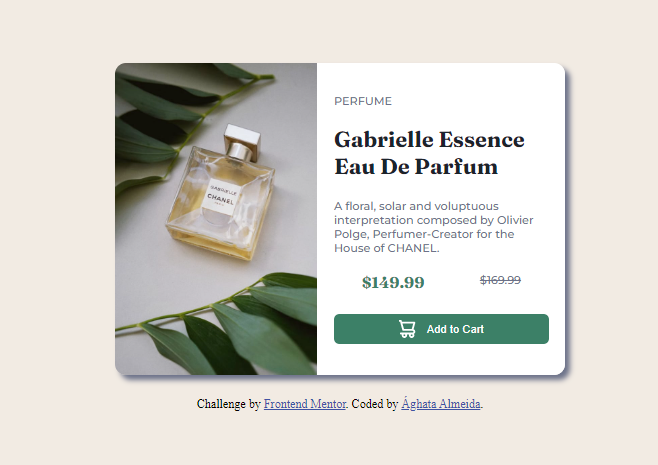
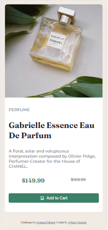

# Frontend Mentor - Desafio Card de produto

Essa é uma solução para o desafio [Product preview card component challenge Frontend Mentor](https://www.frontendmentor.io/challenges/product-preview-card-component-GO7UmttRfa). Os desafios do Frontend Mentor ajudam a desenvolver habilidades reais.

## Índice

- [Desafio](#desafio)
- [Screenshot](#screenshot)
- [Links](#links)
- [Ferramentas](#ferramentas)

### Desafio

O desafio proposto foi construir um Card de Produto com layout moderno e responsivo, que se adapte tanto ao desktop quanto ao mobile.
Os usuários devem conseguir:

- Ver o layout adaptado de acordo com o tamanho do seu dispositivo.
- O botão deve mudar de cor ao passar o mouse.

### Screenshots

Versão Desktop:

Versão Mobile:

### Links

- Veja em funcionamento: [Clique Aqui!](https://product-card-preview-mauve.vercel.app/)
- Meu perfil no Front-end mentor: [Veja mais projetos.](https://www.frontendmentor.io/profile/a-almeida10)

### Ferramentas

- HTML5
- CSS custom properties
- Flexbox
- CSS Grid
